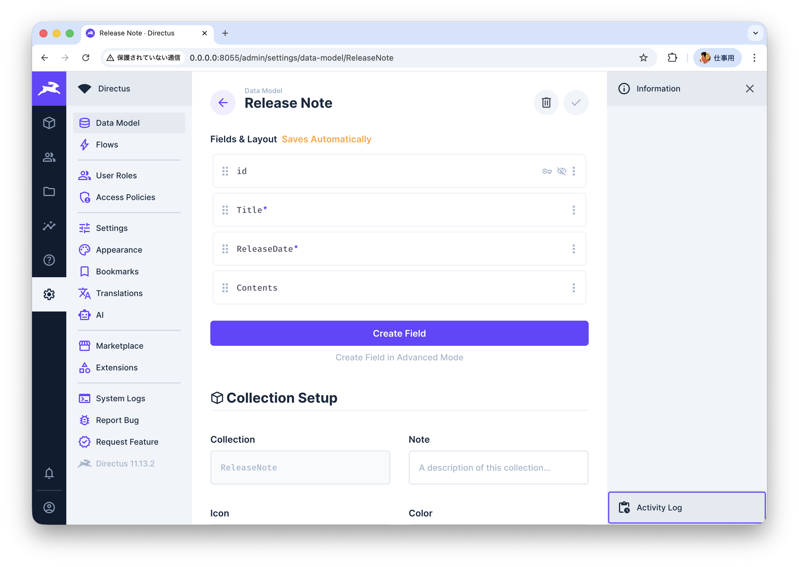

### Getting Start

Cloneしたあと、以下を実行

- dockerを起動
- directus/README.mdの手順の前半を実行
- build-lume/README.mdの手順を実行
- directus/README.mdの手順の後半を実行
- http://0.0.0.0:8055/ へアクセスする

Directusのコンソールで、以下の型で取得できるコレクションを作る。

```typescript
interface ReleaseNote {
    id: number;
    Title: string;
    ReleaseDate: string;
    Contents: string;
}
```
